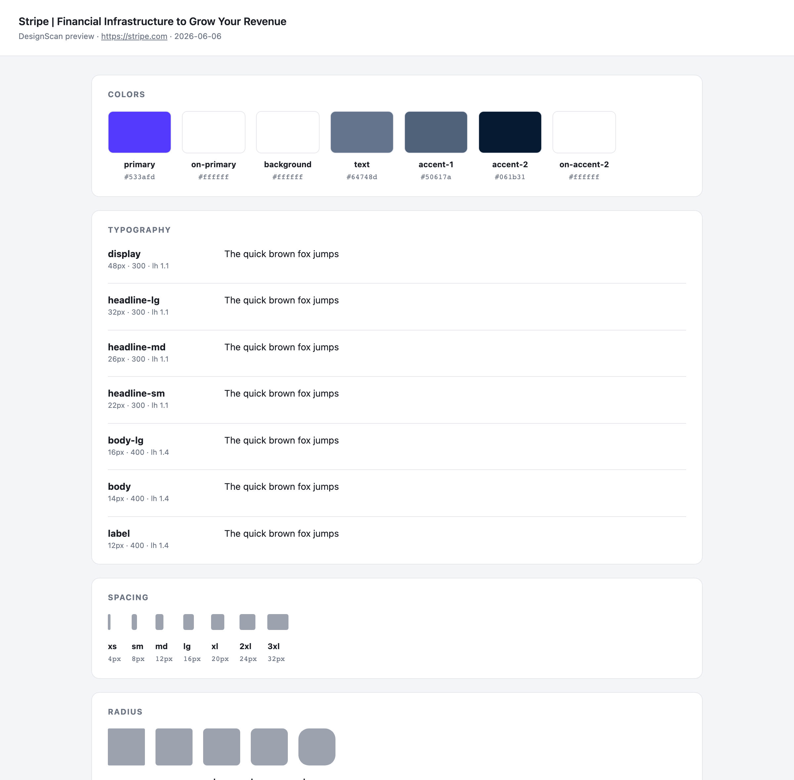
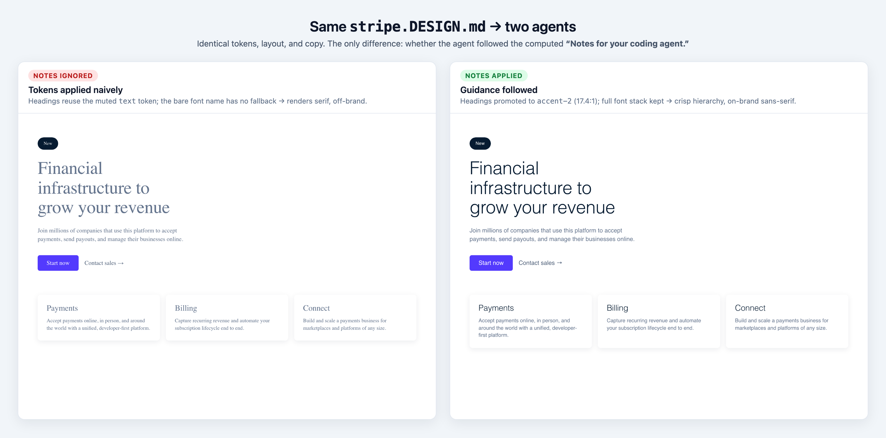
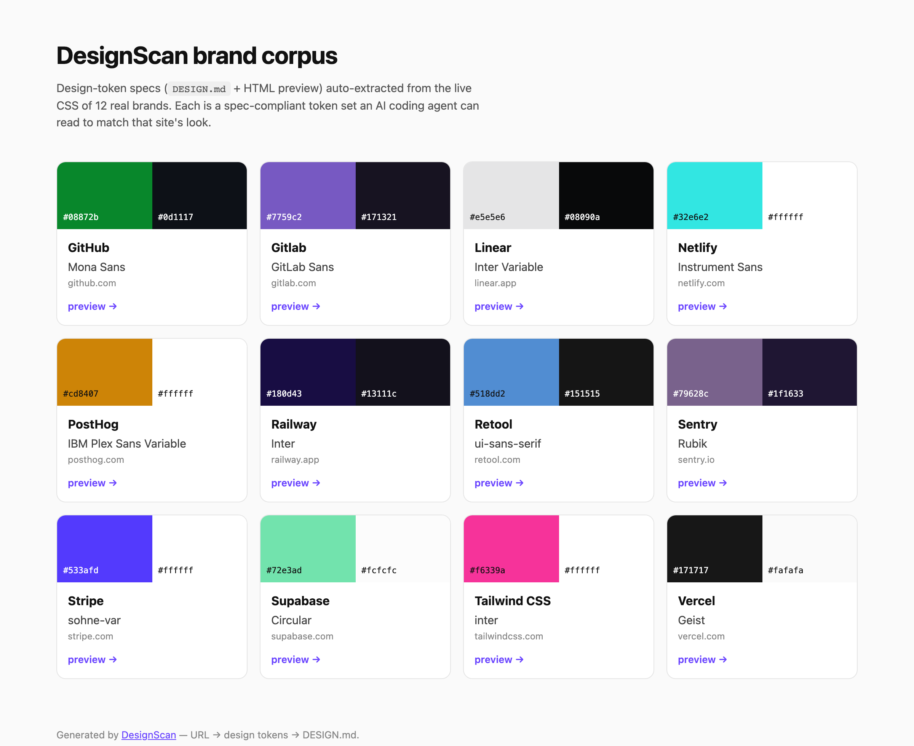

# DesignScan

URL → design tokens → `DESIGN.md`. Point it at any website and get a
spec-compliant [DESIGN.md](https://github.com/google-labs-code/design.md) file
(YAML tokens + prose) that AI coding agents can read to match that site's look.

## Preview

Every run can also emit a self-contained HTML proof sheet (`--preview`) that
renders the extracted tokens — color roles, type specimens, spacing/radius
scales, components — so you can eyeball the result before trusting it:

[](examples/stripe.preview.html)

## Notes for your coding agent

A `DESIGN.md` is always *consumed by an AI coding agent* (Cursor, Claude Code, …).
So rather than run our own LLM to resolve semantic intent, every file ends with a
**Notes for your coding agent** section: deterministic, per-extraction
instructions computed from the actual tokens — heading hierarchy vs. a muted
`text` color, sub-AA body contrast, brand-font fallback, the primary-button
contract, shape/spacing rhythm. The reasoning stays on our side (no API key); the
*application* happens for free inside the agent you already use.

It measurably changes the output. Below: the same `stripe.DESIGN.md` cloned by an
agent that **ignored** the notes (left) vs one that **followed** them (right) —
identical tokens, layout, and copy:



## Brand corpus

A growing, curated library of real-brand specs lives in [`examples/`](examples) —
each one a `DESIGN.md`, an HTML preview, and the raw token JSON, indexed in
[`examples/README.md`](examples/README.md) (visual gallery: [`index.html`](examples/index.html)).

[](examples/README.md)

Rebuild it from the committed JSON with `pnpm seed rebuild` (no network), or add
brands with `pnpm seed add <url>` — degenerate / bot-challenged pages are skipped
automatically so the corpus only holds trustworthy specs.

## Monorepo layout

| Path | What |
|------|------|
| [`packages/extractor`](packages/extractor) | The extraction + generation engine (Playwright → tokens → `DESIGN.md`). |
| [`examples/`](examples) | The brand corpus — `DESIGN.md` + HTML preview + token JSON per brand, with a gallery index. |
| [`docs/`](docs) | Research: market/forensic analysis and acquisition memo (EN/BN). |

## Install (as a CLI / library)

The engine ships as the publishable [`@designscan/extractor`](packages/extractor)
package — a `designscan` CLI and a typed library.

```bash
# one-off, no install
npx @designscan/extractor stripe.com --md --out stripe.DESIGN.md

# or install the CLI
npm i -g @designscan/extractor
npx playwright install chromium   # one-time (the engine drives headless Chromium)
designscan stripe.com --md --preview --out stripe.DESIGN.md
```

## Quick start (from this repo)

This is a [pnpm](https://pnpm.io) workspace (`corepack enable` to get pnpm).

```bash
pnpm install
pnpm --filter @designscan/extractor exec playwright install chromium  # one-time

# token profile (JSON) for any URL
pnpm extract stripe.com

# generate a DESIGN.md (light theme by default)
pnpm extract stripe.com --md --out out/stripe.DESIGN.md

# pick a theme: light (default) | dark | both
pnpm extract vercel.com --md --theme dark --out out/vercel.dark.DESIGN.md

# both = bundle light + dark into one file (parallel *-dark tokens)
pnpm extract vercel.com --md --theme both --out out/vercel.DESIGN.md

# --preview = also write a self-contained HTML proof sheet beside the file,
# rendering every token (swatches, type specimens, scales, components) so you
# can eyeball the extraction before trusting it (--theme both adds a Light/Dark toggle)
pnpm extract stripe.com --md --preview --out out/stripe.DESIGN.md
# → out/stripe.DESIGN.md  +  out/stripe.preview.html

# --strict = exit non-zero if the result looks degenerate (bot challenge / too
# few signals), for CI/automation that must not consume junk tokens
pnpm extract stripe.com --strict --quiet

# seed / rebuild the curated brand corpus under examples/
pnpm seed add tailwindcss.com vercel.com   # extract live + add to the corpus
pnpm seed rebuild                          # regen md/preview/gallery from JSON
```

## Scripts (root)

| Script | Does |
|--------|------|
| `pnpm extract <url> [--md] [--theme light\|dark\|both] [--preview] [--strict] [--timeout ms] [--out f]` | Extract tokens / generate `DESIGN.md` (`--theme both` = light + dark in one file; `--preview` = HTML proof sheet beside it; `--strict` = non-zero exit on a degenerate result) |
| `pnpm seed rebuild` / `pnpm seed add <url…>` | Build the brand corpus under `examples/` (md + preview + gallery; `add` extracts live) |
| `pnpm build` | Compile the publishable package (`tsc` → `dist`) |
| `pnpm typecheck` | Type-check all packages |
| `pnpm test` | Run the test suite (vitest) |
| `pnpm check` | Biome — format + lint (use `pnpm format` to auto-fix) |
| `pnpm lint:designmd` | Validate `examples/*.DESIGN.md` against the official spec |

All of these run on every push/PR via [GitHub Actions](.github/workflows/ci.yml).
The engine is consumable as a library through its public API
([`packages/extractor/src/index.ts`](packages/extractor/src/index.ts)).

## Status

- [x] **Step 1 — Extraction engine** (Playwright → clean token profile)
- [x] **Step 2 — Generator** (token profile → spec-valid `DESIGN.md`, lint-clean)
- [x] **Step 3 — HTML preview** (`--preview` → self-contained token proof sheet, light/dark toggle)
- [~] **Step 4** — agent guidance. Each `DESIGN.md` now ships a **Notes for your
      coding agent** section: deterministic, per-extraction instructions (contrast,
      heading hierarchy, font fallback) so the consuming agent applies the tokens
      with intent — no LLM on our side. (Optional LLM-refined prose still future.)
- [~] **Step 5** — brand-seed library (`pnpm seed`, curated [corpus](examples) + gallery) done; `npx … add` / checkout next

See [`packages/extractor/README.md`](packages/extractor/README.md) for the full
roadmap and engine details.
